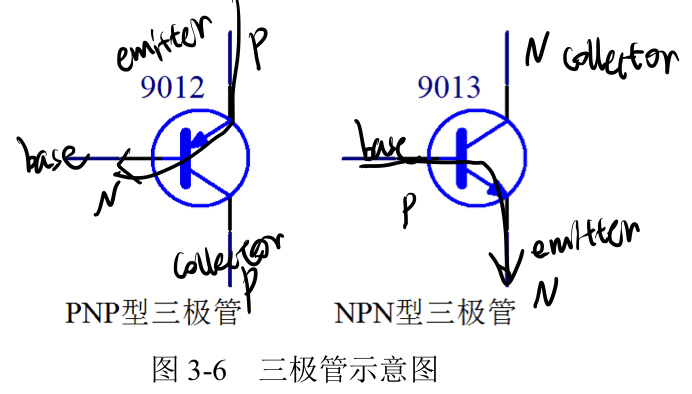
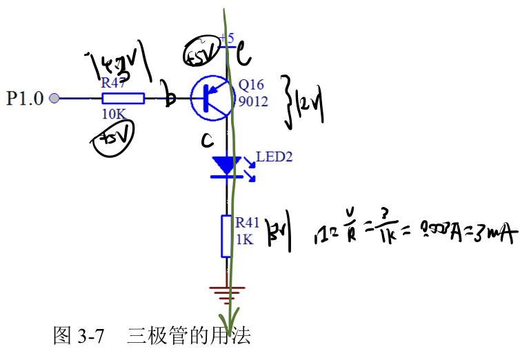

# 点亮一个小灯

## 三极管

三极管分为PNP和NPN型：

在数字电路中主要用到的是三极管的开关特性。

### 分辨PNP和NPN

看箭头方向，箭头的尾部是P，头部是N。箭头所指的方向是P --> N

### 三极管的应用

单片机通过控制三极管的基极（base）来间接控制后面小灯的亮灭。

发射极（e级）接了高电平5v，如果P1.0给予高电平5v，则e到b级之间不会产生0.7v的压降，则e和c之间不会导通，LED2小灯也就不会亮。

如果P1.0给予低电平0v，则e到b之间会有0.7v左右的压降，还有（5-0.7）v的电压会加在电阻R47上，这时候e和c之间就导通了，LED2会亮。