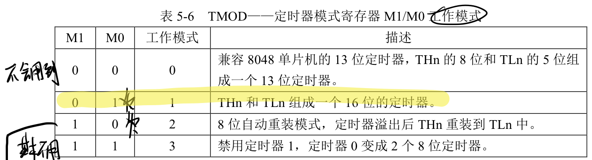

# 定时器怎么计算初始值？

## 时间单位与频率单位

首先，板子上的晶振是11.0592Mhz。

频率单位与时间单位互为倒数关系。

s		ms	 um	  nm

Hz	 Khz	Mhz	Ghz

例：需要定时0.02s

0.02s = 20ms = 20000um

时钟周期：1/11.0592um

机器周期：12/11.0592um

A * 12/11.0592 = 20000，求A

解得：A = 18432

## 定时器模式

定时器有4种模式：

一般采用模式1——使用16位的定时器

16位的最大整数是65535。我们希望定一个初值，使得加上18432后等于65536。——正好溢出。

初值y = 65536-18432 = 47104 ，转换为16进制是 B800。

所以我们需要设置 TL0 = 0x00，TH0 = 0xB8